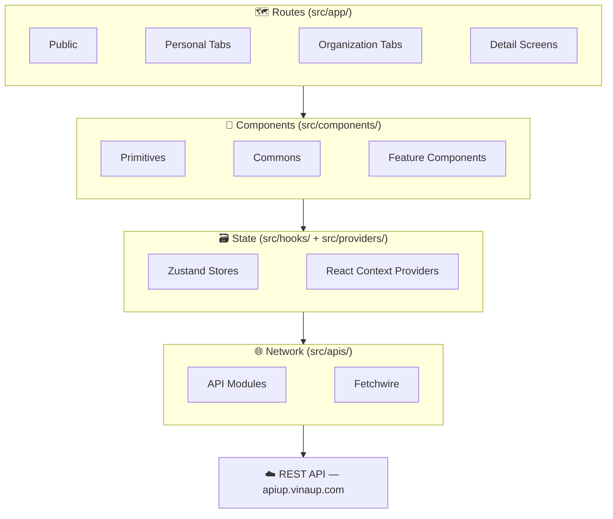
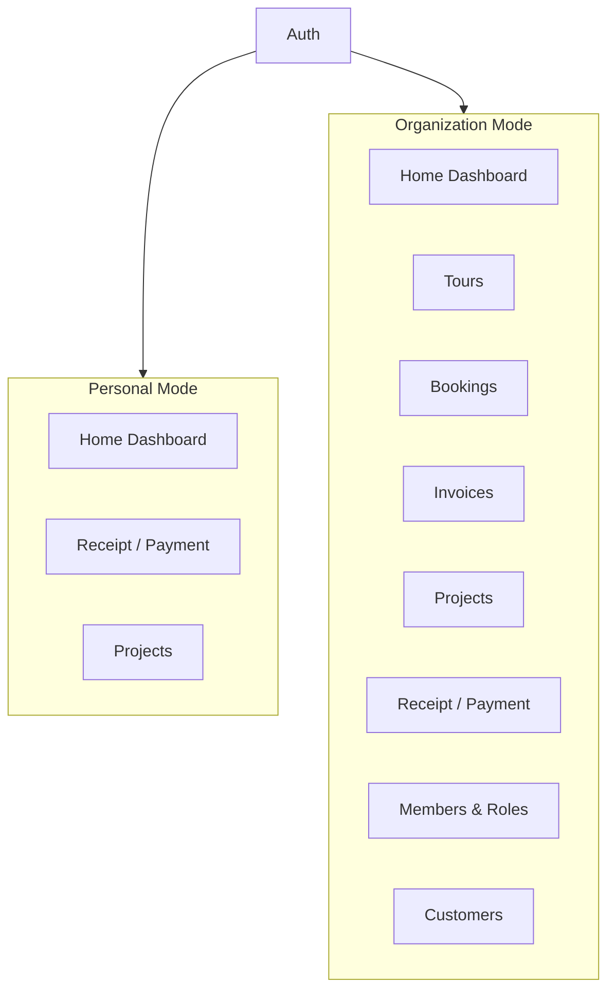

# VinaUp Mobile — Component Diagram

## High-Level

Data flows top-to-bottom; user interactions bubble upward.

---

## Features

---

## React Component Layer

| Layer | Directory | Purpose |
|-------|-----------|---------|
| **Primitives** | `src/components/primitives/` | Base UI atoms — Button, Input, Select, DateTimePicker, SlideSheet, Skeleton, Carousel, Popover, Avatar |
| **Commons** | `src/components/commons/` | Cross-feature components — modals, headers, cards, selectors, skeletons, signature canvas, grids |
| **Feature** | `src/components/organization/` `src/components/personal/` | Domain-specific components scoped to Personal or Organization mode |
| **Icons** | `src/components/icons/` | 36+ custom SVG icon components |

---

## State Management Layer

| Layer | Directory | Purpose |
|-------|-----------|---------|
| **Zustand** | `src/hooks/` | Pure client-side state: modal open/close, form fields, navigation loading indicator, per-org utility preferences |
| **React Context** | `src/providers/` | Server-derived data: current user (auth), organization list, entity currently being viewed (tour, project, invoice, booking) |

---

## Key Directories

| Directory | Role |
|-----------|------|
| `src/app/` | File-based navigation via Expo Router |
| `src/apis/` | One file per business domain, Fetchwire-based |
| `src/components/` | UI component library |
| `src/providers/` | React Context providers for server state |
| `src/hooks/` | Zustand stores for client state |
| `src/interfaces/` | TypeScript type definitions per domain |
| `src/constants/` | App-wide enums, colors, and configuration |
| `src/utils/calculator/` | Business calculation helpers — pure functions |
| `src/utils/generator/string-generator/` | String formatting utilities — pure functions |
| `src/utils/generator/file-generator/html/` | HTML template generators — pure functions |
| `src/utils/generator/file-generator/pdf/` | PDF creation and sharing — uses Expo file system |
| `src/utils/generator/file-generator/excel/` | Excel export — placeholder |

---