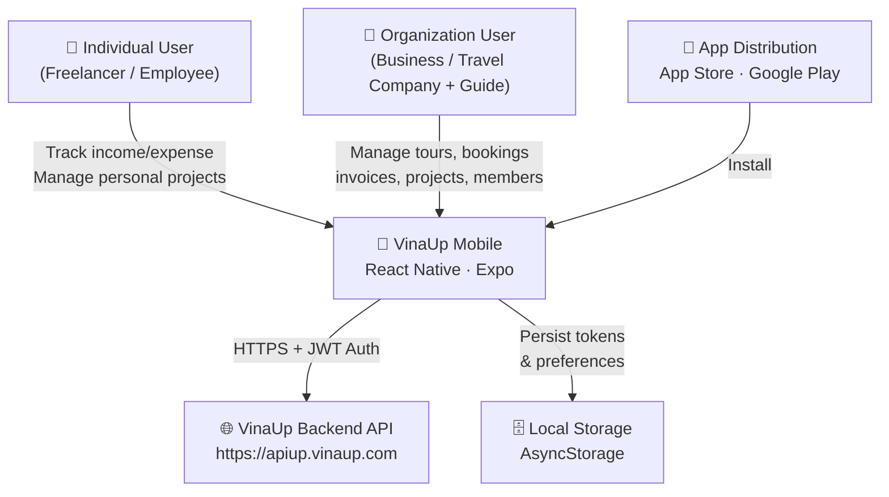

# VinaUp Mobile — System Context Diagram

```mermaid
graph TD
    UA["👤 Individual User\n(Freelancer / Employee)"]
    UB["👥 Organization User\n(Business / Travel Company + Guide)"]

    APP["📱 VinaUp Mobile\nReact Native · Expo"]

    API["🌐 VinaUp Backend API\nhttps://apiup.vinaup.com"]
    STORE["🗄️ Local Storage\nAsyncStorage"]
    DIST["🏪 App Distribution\nApp Store · Google Play"]

    UA  -->|"Track income/expense\nManage personal projects"| APP
    UB  -->|"Manage tours, bookings\ninvoices, projects, members"| APP

    DIST -->|"Install"| APP
    APP  -->|"HTTPS + JWT Auth"| API
    APP  -->|"Persist tokens\n& preferences"| STORE
```

---

> See [COMPONENT.md](./COMPONENT.md) for the internal structure of VinaUp Mobile.
